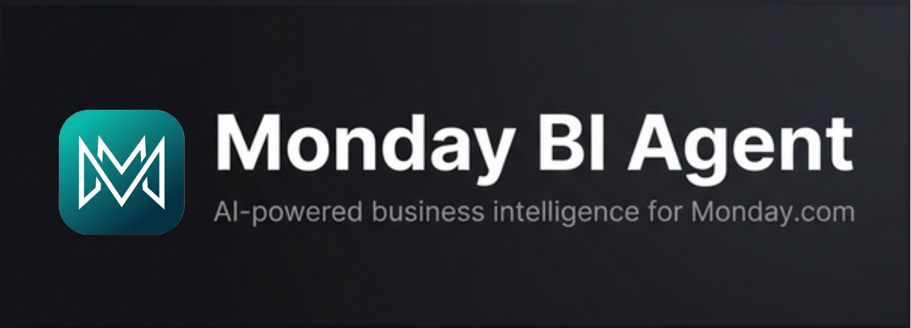

<h1 align="center">Monday BI Agent</h1>

<p align="center">
  
</p>

<p align="center">
  AI-powered business intelligence for your Monday.com boards.
</p>

<p align="center">
  
  
  
  
  
</p>

---


## About

Monday BI Agent is an AI agent that answers founder-level business intelligence queries by connecting to live Monday.com boards. It interprets natural language questions, pulls real-time data from Deals and Work Orders boards, cleans messy data, computes metrics, and delivers concise, actionable insights through a conversational interface.

Built for the Skylark Drones AI Engineer technical assessment.

---

## Features

- **Live API integration** - Every query triggers fresh Monday.com GraphQL API calls. No caching or preloading.
- **Two-stage AI pipeline** - Stage 1 understands the query and creates a structured plan. Stage 2 generates a founder-level briefing from the data.
- **Data resilience** - Handles missing values, inconsistent date formats, malformed numbers, and messy text fields.
- **Data quality reporting** - Transparent reporting of missing values, parsing failures, and data issues alongside every response.
- **Action trace** - Visible step-by-step trace of every API call and processing step the agent performs.
- **Clarifying questions** - Asks for clarification when queries are too vague or ambiguous instead of guessing.
- **Cross-board queries** - Can query Deals, Work Orders, or both boards in a single request.
- **Conversation memory** - Follow-up questions maintain context from previous messages.
- **Dark/light mode** - Toggle between dark and light themes with saved preference.
- **Graceful error handling** - Friendly error messages for rate limits, API failures, and malformed queries.

---

## Tech Stack

| Component | Technology |
|-----------|------------|
| Frontend | React 19, Vite, Tailwind CSS v4 |
| Backend | Python 3.11, FastAPI, Uvicorn |
| LLM | Groq (LLaMA 3.3 70B Versatile) |
| Data Source | Monday.com GraphQL API |
| Markdown Rendering | react-markdown |
| Frontend Hosting | Vercel |
| Backend Hosting | HuggingFace Spaces (Docker) |

---

## Getting Started

### Prerequisites

- Python 3.11+
- Node.js 18+
- Monday.com account with API token
- Groq API key ([console.groq.com](https://console.groq.com))

### Backend Setup

```bash
cd backend

# Install dependencies
pip install -r requirements.txt

# Create environment file
# Add your MONDAY_API_TOKEN, MONDAY_DEALS_BOARD_ID,
# MONDAY_WORKORDERS_BOARD_ID, and GROQ_API_KEY
cp .env.example .env

# Start the server
python main.py
# Runs at http://localhost:7860
```

### Frontend Setup

```bash
cd frontend

# Install dependencies
npm install

# Set backend URL (optional, defaults to http://localhost:7860)
echo "VITE_API_BASE_URL=http://localhost:7860" > .env

# Start the dev server
npm run dev
# Opens at http://localhost:5173
```

### Docker (Backend)

```bash
cd backend
docker build -t monday-bi-agent .
docker run -p 7860:7860 --env-file .env monday-bi-agent
```

---

## Usage

Open the frontend in your browser and type a natural language question. The agent will fetch live data, process it, and return a concise business insight.

**Sample queries:**

- "How is our pipeline looking this quarter?"
- "Total value of open work orders?"
- "Which deals are at risk of stalling?"
- "Mining vs Construction sector comparison"
- "Show me overdue work orders"
- "Break down deals by closure probability"
- "What is our average deal size?"
- "Give me a revenue summary"

The sidebar panel shows a step-by-step action trace and data quality report for every query.

---

## Project Structure

```
monday-bi-agent/
├── backend/
│   ├── main.py                # FastAPI entry point, API routes
│   ├── agent.py               # Two-stage LLM pipeline (query + response)
│   ├── monday_client.py       # Monday.com GraphQL API client
│   ├── data_cleaner.py        # Data normalization and quality reporting
│   ├── config.py              # Environment variable configuration
│   ├── Dockerfile             # Docker config for HuggingFace Spaces
│   └── requirements.txt       # Python dependencies
├── frontend/
│   ├── src/
│   │   ├── App.jsx            # Root component, state, layout
│   │   ├── api/
│   │   │   └── monday.js      # Backend API client (Axios)
│   │   └── components/
│   │       ├── ChatWindow.jsx      # Chat messages, markdown rendering
│   │       ├── InputBar.jsx        # Query input with send button
│   │       ├── ActionTrace.jsx     # Step-by-step trace timeline
│   │       └── DataQualityReport.jsx  # Collapsible quality stats
│   ├── public/
│   │   └── logo.png           # App logo
│   ├── index.html             # HTML entry point
│   ├── vite.config.js         # Vite configuration
│   └── package.json           # Node dependencies
├── assets/
│   └── banner.png             # README banner image
├── DECISION_LOG.md            # Technical decision justifications
├── README.md
├── .gitignore
└── LICENSE
```

---

## Architecture

```
┌──────────────────┐       ┌───────────────────┐       ┌──────────────┐
│  React Frontend  │──────>│  FastAPI Backend   │──────>│  Monday.com  │
│  (Vercel)        │ REST  │  (HuggingFace)    │GraphQL│  Boards API  │
└──────────────────┘       │                   │       └──────────────┘
                           │  ┌─────────────┐  │
                           │  │ LLaMA 3.3   │  │
                           │  │ (via Groq)  │  │
                           │  └─────────────┘  │
                           └───────────────────┘
```

**Pipeline flow:**

1. User submits a natural language question
2. Backend fetches board schemas and available filter values from Monday.com
3. LLM Stage 1 interprets the question and generates a structured JSON query plan
4. Backend fetches live data, cleans it, and computes requested metrics
5. LLM Stage 2 generates a concise, founder-level briefing from the processed data
6. Response is returned with the answer, action trace, and data quality report

---

## Environment Variables

### Backend

| Variable | Description |
|----------|-------------|
| `MONDAY_API_TOKEN` | Monday.com Personal API Token |
| `MONDAY_DEALS_BOARD_ID` | Board ID for the Deals board |
| `MONDAY_WORKORDERS_BOARD_ID` | Board ID for the Work Orders board |
| `GROQ_API_KEY` | Groq API key for LLM inference |

### Frontend

| Variable | Description |
|----------|-------------|
| `VITE_API_BASE_URL` | URL of the deployed FastAPI backend |

---


## License

This project is licensed under the [MIT License](LICENSE).

---

## Author

**Divyanshu Sharma**
Final-year B.Tech, Data Science

- GitHub: [@dsharma08k](https://github.com/dsharma08k)
- Email: dsharma08k@gmail.com
